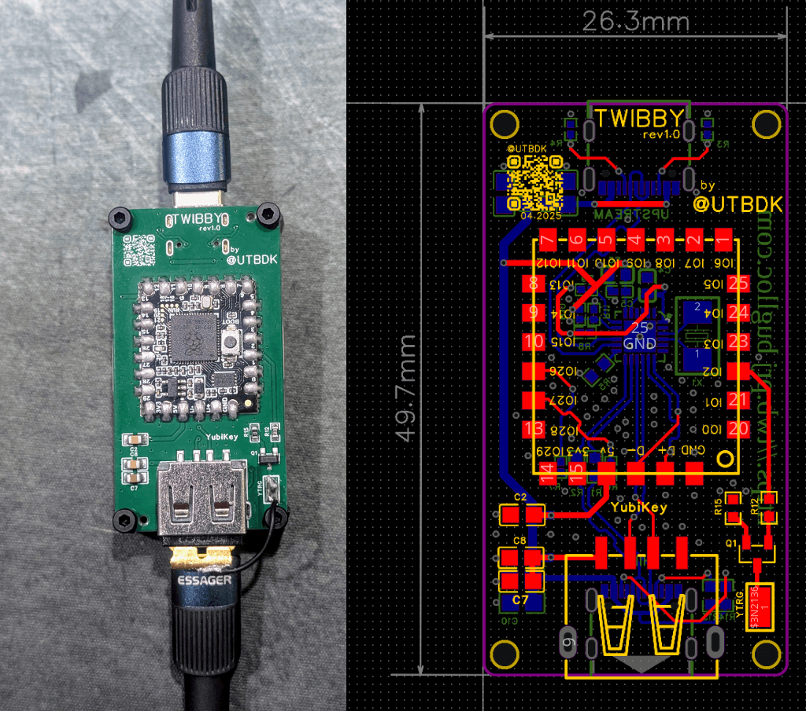
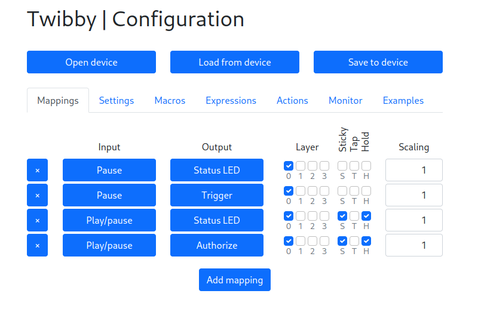

# Twibby

## Overview

Twibby is a customized **HID Remapper** device, built on the [excellent open-source project](https://www.remapper.org/), with extended capabilities to interact with **YubiKeys**. It runs on an RP2040 microcontroller and includes a custom PCB designed to:
  - Remap USB HID input (keyboards, mice, gamepads) in real-time
  - Intercept and transform input using layers, macros, and tap/hold modifiers
  - **Simulate a “touch” on a YubiKey**, enabling automatic FIDO2 or PIV functions requiring touch

---

## YubiKey Touch Integration

YubiKey operations often require a physical touch for **user presence verification**. This device integrates a transistor trigger that can simulate this touch under programmable conditions — by pressing a specific keyboard key.

---

## Features

- ✅ Full-featured HID remapping: macros, layers, tap/hold behavior
- ✅ USB HID proxy and pass-through support
- ✅ Built on RP2040 for ultra-low latency and high reliability
- ✅ Optional YubiKey touch trigger support
- ✅ Secure configuration: interface only exposed when required

---

## Use Cases

- Auto-confirm FIDO2 authentication when typing a specific password
- Chain FIDO2/OTO/PIV + HID + touch confirmation from a single action
- Use a footpedal or gamepad to trigger GPG signing
- Improve accessibility for secure 2FA workflows

---

## Configuration

Like original HID remapper it is configurable [through a web browser](https://twbcfg.buglloc.com/) using WebHID (Chrome or Chrome-based browser required). Sample configuration:

---

## Hardware

Custom-designed PCB with:
- FE2.1 USB Hub controller
- Raspberry Pi Pico RP2040-Core-A Microcontroller with onboard LED indicators
- USB host and device ports
- Touch simulation pad
- Designed to be a USB sniffer or HID remapper (R1 and R2 need to be removed for remapper)

Schematic, PCB, etc: [OSHWLab](https://oshwlab.com/buglloc/twibby)

---

## License

This project builds upon [Remapper](https://github.com/jfedor2/hid-remapper), licensed under MIT. All additions and hardware designs are also released under MIT unless noted otherwise.

---

## Acknowledgments

- Huge thanks to [Jacek Fedorynski](https://github.com/jfedor2) for the original [HID Remapper](https://github.com/jfedor2/hid-remapper)
- Inspired by real-world security workflows involving hardware tokens
